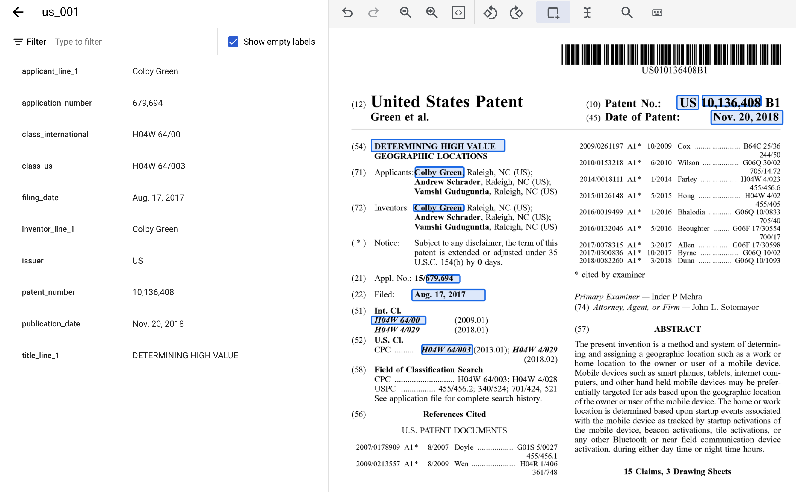

# Task 1. Enable the Document AI API
1. Search "Document AI API" and select *Cloud Document AI API*
2. Enable the *Cloud Document AI API*

# Task 2. Create a processor
- Create a Custom Extractor processor with the name *custom-document-extractor-vmif*. Use the region *US (United States)*.

# Task 3. Define processor fields
1. Create each of the following labels for the processor schema.
Name |	Data | Type |	Occurrence
----|----|----|----|
applicant_line_1	|Plain Text|	Required once
application_number|	Number	|Required once
class_international	|Plain Text|	Required once
class_us	|Plain Text	|Required once
filing_date	|Datetime	|Required once
inventor_line_1	|Plain text|	Required once
issuer|	Plain text|	Required once
patent_number	Number	|Required| once
publication_date|	Datetime	\Required once
title_line_1	|Plain text|	Required once

# Task 4. Import a document into a dataset
1. Import the following document into your dataset:
`gs://cloud-samples-data/documentai/codelabs/challenge/unlabeled/us_001.pdf`
2. For Data split, use *Test Document*
3. Check *Import with auto-labeling*

# Task 5. Label a document
1. Start labeling
2. Add the following labels to the us_001 document:
- applicant_line_1 = Colby Green
- application_number = 679,694
- class_international = H04W 64/00
- class_us = H04W 64/003
- filing_date = Aug. 17, 2017
- inventor_line_1 = Colby Green
- issuer = US
- patent_number = 10,136,408
- publication_date = Nov. 20, 2018
- title_line_1 = DETERMINING HIGH VALUE

### The labeled patent document should look like this when complete:

# Task 6. Assign an annotated document to the training set
- Assign the us_001 document to the training set.

# Task 7. Import pre-labeled data to the training and test sets
1. Import the following pre-labeled documents into your dataset:
`gs://cloud-samples-data/documentai/codelabs/challenge/labeled`
2. For Data split, use *Auto-split*. Leave Import with auto-labeling unchecked.

# Task 8. Train the processor
- Train a new version of the processor. Use the following name for the processor version: cde-version-1.
